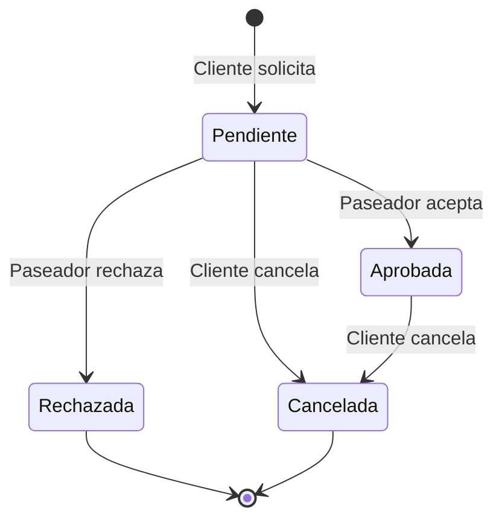

# 🐕 Sistema Nubbi - Paseadores de Perros

[](https://developer.mozilla.org/en-US/docs/Web/HTML)
[](https://developer.mozilla.org/en-US/docs/Web/CSS)
[](https://developer.mozilla.org/en-US/docs/Web/JavaScript)
[](https://getbootstrap.com/)

> **Sistema de gestión inteligente que conecta dueños de perros con paseadores profesionales**

---

## 🌟 Características Principales

- 🔐 **Sistema de Autenticación** dual (Clientes/Paseadores)
- 🐕 **Gestión Inteligente de Compatibilidad** entre perros
- 📊 **Sistema de Cupos** basado en tamaño de mascotas  
- 📱 **Interfaz Responsiva** con Bootstrap
- ⚡ **Single Page Application** sin recargas

---

## 🔗 Documentación Técnica

### 📚 Guías Completas
- **[📋 Visión General](./docs/README.md)** - Introducción y objetivos del proyecto
- **[🏗️ Arquitectura](./docs/arquitectura.md)** - Diseño técnico y patrones con diagramas
- **[🔧 Clases](./docs/clases.md)** - Documentación detallada de todas las clases
- **[🔄 Flujos](./docs/flujos.md)** - Diagramas de procesos y workflows
- **[📚 API](./docs/api.md)** - Documentación estilo REST de todas las funciones

### 🎯 Para Diferentes Audiencias

#### 👨‍🎓 **Estudiantes y Desarrolladores**
```bash
# Comienza aquí
1. 📋 Visión General → Entiende el proyecto
2. 🏗️ Arquitectura → Aprende el diseño  
3. 🔧 Clases → Estudia las entidades
4. 🔄 Flujos → Visualiza los procesos
```

#### 👨‍💼 **Evaluadores Académicos**
```bash
# Revisión completa
1. 🏗️ Arquitectura → Patrones y diseño técnico
2. 📚 API → Funcionalidades implementadas
3. 🔄 Flujos → Lógica de negocio
4. 🔧 Clases → Implementación orientada a objetos
```

#### 🧑‍💻 **Futuros Desarrolladores**
```bash
# Extensión del sistema
1. 📚 API → Funciones disponibles
2. 🔧 Clases → Estructura de datos
3. 🏗️ Arquitectura → Puntos de extensión
```

---

### 🎮 Uso Básico

#### Como Cliente:
1. **Registro** → Crea cuenta con datos del perro
2. **Login** → Accede al dashboard
3. **Contratar** → Selecciona paseador compatible
4. **Gestionar** → Ve estado de tu contratación

#### Como Paseador:
1. **Login** → (Paseadores pre-cargados en sistema)
2. **Dashboard** → Ve solicitudes pendientes
3. **Evaluar** → Aprueba/rechaza según capacidad
4. **Gestionar** → Ve perros asignados

---

## 🧠 Reglas de Negocio

### 🐕 Sistema de Compatibilidad
| Tamaño Perro | Cupos Usados | Compatible Con |
|--------------|-------------|----------------|
| 🐕‍🦺 **Grande** | 4 cupos | Grandes, Medianos |
| 🐕 **Mediano** | 2 cupos | **Todos** |
| 🐕‍🦺 **Chico** | 1 cupo | Chicos, Medianos |

### 📊 Estados de Contratación


---

## 🛠️ Stack Tecnológico

### Frontend
- **HTML5** - Estructura semántica
- **CSS3** - Estilos personalizados  
- **Bootstrap 5** - Framework responsive
- **JavaScript ES6+** - Lógica del cliente

### Arquitectura
- **Patrón MVC** - Separación de responsabilidades
- **POO** - Clases y encapsulación
- **SPA** - Single Page Application
- **Módulos** - Organización del código

---

## 📁 Estructura del Proyecto

```
📦 entrega-nubbi-obligatorio/
├── 📄 index.html              # Punto de entrada
├── 🎨 css/                    # Estilos
│   ├── login.css
│   ├── register.css
│   ├── dashboard-cliente.css
│   └── dashboard-paseador.css
├── 🧠 js/                     # Lógica JavaScript
│   ├── 🏗️ clases/            # Modelos de datos
│   │   ├── sistema.js         # Controlador principal
│   │   ├── cliente.js         # Entidad Cliente
│   │   ├── paseador.js        # Entidad Paseador
│   │   ├── perro.js           # Entidad Perro
│   │   └── contratacion.js    # Entidad Contratación
│   ├── 📱 pages/              # Controladores de vista
│   │   ├── init-login.js
│   │   ├── init-register.js
│   │   ├── init-dashboard-cliente.js
│   │   └── init-dashboard-paseador.js
│   ├── 🔧 utils/              # Utilidades
│   │   ├── navigation.js      # Navegación SPA
│   │   └── mensajes.js        # Sistema de alertas
│   └── 🚀 index.js            # Inicialización
├── 🖼️ img/                    # Recursos gráficos
└── 📚 docs/                   # Documentación completa
    ├── README.md              # Visión general
    ├── arquitectura.md        # Diseño técnico con diagramas
    ├── clases.md              # Documentación de clases
    ├── flujos.md              # Procesos con diagramas Mermaid
    └── api.md                 # Documentación estilo REST
```