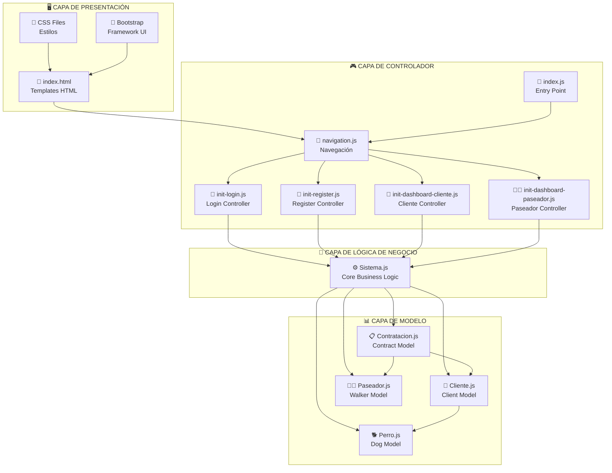
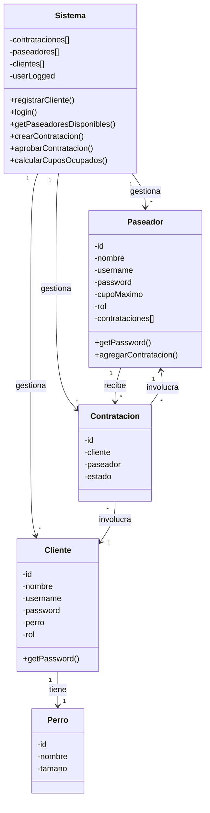

# 📐 Arquitectura del Sistema Nubbi

## 🏗️ Visión General

El sistema Nubbi está diseñado siguiendo el patrón **MVC (Modelo-Vista-Controlador)** con una arquitectura orientada a objetos que separa claramente las responsabilidades.

## 🔧 Componentes Principales

### 📊 Modelo (Clases de Datos)
- **Sistema**: Controlador principal que gestiona toda la lógica de negocio
- **Cliente**: Representa a los dueños de perros
- **Paseador**: Representa a los cuidadores de perros
- **Perro**: Información de las mascotas
- **Contratacion**: Relación entre cliente y paseador

### 🖥️ Vista (Templates HTML)
- **Templates**: Componentes reutilizables en HTML
- **CSS**: Estilos específicos para cada vista
- **Bootstrap**: Framework CSS para responsividad

### 🎮 Controlador (JavaScript)
- **Sistema.js**: Lógica de negocio principal
- **Pages**: Controladores específicos para cada vista
- **Utils**: Funciones auxiliares y navegación

## 📋 Diagrama de Arquitectura General


## 🔗 Relaciones entre Clases


## 🔄 Flujo de Datos

### Registro de Cliente
```
Usuario → Formulario → init-register.js → Sistema.registrarCliente() → new Cliente() → Array clientes[]
```

### Login
```
Usuario → Formulario → init-login.js → Sistema.login() → Validación → Dashboard
```

### Contratación
```
Cliente → Dashboard → init-dashboard-cliente.js → Sistema.getPaseadoresDisponibles() → Sistema.crearContratacion()
```

### Gestión de Paseador
```
Paseador → Dashboard → init-dashboard-paseador.js → Sistema.getContratacionesPendientes() → Sistema.aprobarContratacion()
```

## 🏛️ Arquitectura de Archivos

### Separación por Responsabilidades

```
js/
├── clases/          # MODELO - Entidades de datos
│   ├── sistema.js   # Lógica de negocio central
│   ├── cliente.js   # Entidad Cliente
│   ├── paseador.js  # Entidad Paseador
│   ├── perro.js     # Entidad Perro
│   └── contratacion.js # Entidad Contratación
├── pages/           # CONTROLADOR - Lógica de vistas
│   ├── init-login.js
│   ├── init-register.js
│   ├── init-dashboard-cliente.js
│   └── init-dashboard-paseador.js
├── utils/           # UTILIDADES - Funciones auxiliares
│   ├── navigation.js # Navegación entre vistas
│   └── mensajes.js   # Sistema de mensajes
└── index.js         # PUNTO DE ENTRADA
```

## 🔐 Seguridad y Validaciones

### Validaciones del Sistema
- **Contraseñas**: Mínimo 5 caracteres, mayúscula, minúscula, número
- **Usernames**: Únicos en todo el sistema
- **Campos**: Validación de campos obligatorios
- **Compatibilidad**: Reglas de negocio para perros

### Encapsulación
- Propiedades privadas con `#password`
- Métodos privados con `#validarPassword()`, `#existeUsername()`
- Getters para acceso controlado: `getPassword()`
