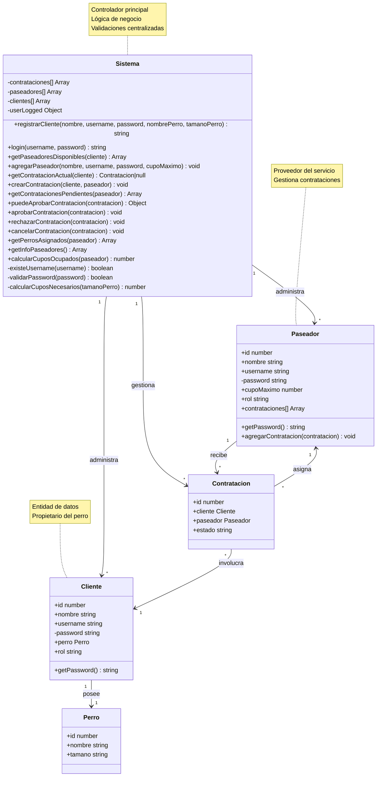

# 🏗️ Documentación de Clases

Esta documentación describe todas las clases del sistema Nubbi y sus responsabilidades.

## 📊 Diagrama de Clases

[Ver diagrama de relaciones en el archivo de arquitectura](./arquitectura.md#relaciones-entre-clases)

## 🔧 Diagrama Detallado de Métodos



---

## ⚙️ Clase Sistema

**Archivo**: `js/sistema.js`  
**Responsabilidad**: Controlador principal que gestiona toda la lógica de negocio del sistema.

### 🏗️ Constructor
```javascript
constructor()
```
**Descripción**: Inicializa el sistema con arrays vacíos para almacenar datos.

**Propiedades inicializadas**:
- `contrataciones[]`: Lista de todas las contrataciones
- `paseadores[]`: Lista de todos los paseadores  
- `clientes[]`: Lista de todos los clientes
- `userLogged`: Usuario actualmente logueado (null inicialmente)

### 👥 Métodos de Gestión de Usuarios

#### `registrarCliente(nombre, username, password, nombrePerro, tamanoPerro)`
**Descripción**: Registra un nuevo cliente en el sistema con su perro.

**Parámetros**:
- `nombre` (string): Nombre del cliente
- `username` (string): Nombre de usuario único
- `password` (string): Contraseña del cliente
- `nombrePerro` (string): Nombre del perro
- `tamanoPerro` (string): Tamaño del perro ("chico", "mediano", "grande")

**Retorna**: 
- `"ok"` si el registro fue exitoso
- String con mensaje de error específico

**Validaciones**:
- ✅ Todos los campos obligatorios
- ✅ Username único
- ✅ Contraseña segura

#### `login(username, password)`
**Descripción**: Autentica un usuario en el sistema.

**Parámetros**:
- `username` (string): Nombre de usuario
- `password` (string): Contraseña

**Retorna**:
- `"ok"` si el login fue exitoso
- String con mensaje de error

**Proceso**:
1. Valida formato de contraseña
2. Busca en paseadores
3. Busca en clientes
4. Establece `userLogged` si encuentra coincidencia

### 🐕 Métodos de Gestión de Paseadores

#### `getPaseadoresDisponibles(cliente)`
**Descripción**: Encuentra paseadores compatibles y disponibles para un cliente específico.

**Parámetros**:
- `cliente` (Cliente): Objeto cliente que busca paseador

**Retorna**: Array de paseadores disponibles

**Lógica**:
1. Calcula cupos necesarios según tamaño del perro
2. Verifica cupos disponibles de cada paseador
3. Verifica compatibilidad con perros ya asignados
4. Aplica reglas de negocio (grandes no con chicos)

#### `agregarPaseador(nombre, username, password, cupoMaximo)`
**Descripción**: Agrega un nuevo paseador al sistema.

**Parámetros**:
- `nombre` (string): Nombre del paseador
- `username` (string): Usuario único
- `password` (string): Contraseña
- `cupoMaximo` (number): Capacidad máxima de cupos

### 📋 Métodos de Gestión de Contrataciones

#### `getContratacionActual(cliente)`
**Descripción**: Verifica si un cliente tiene una contratación activa.

**Parámetros**:
- `cliente` (Cliente): Cliente a verificar

**Retorna**: 
- Objeto `Contratacion` si tiene una activa
- `null` si no tiene contrataciones activas

#### `crearContratacion(cliente, paseador)`
**Descripción**: Crea una nueva contratación entre cliente y paseador.

**Parámetros**:
- `cliente` (Cliente): Cliente solicitante
- `paseador` (Paseador): Paseador seleccionado

**Proceso**:
1. Crea objeto Contratacion
2. Lo asigna al paseador
3. Lo agrega a la lista general

#### `getContratacionesPendientes(paseador)`
**Descripción**: Obtiene todas las contrataciones pendientes de un paseador.

**Parámetros**:
- `paseador` (Paseador): Paseador a consultar

**Retorna**: Array de contrataciones pendientes

#### `puedeAprobarContratacion(contratacion)`
**Descripción**: Valida si una contratación puede ser aprobada.

**Parámetros**:
- `contratacion` (Contratacion): Contratación a evaluar

**Retorna**: Objeto con `puede` (boolean) y `motivo` (string)

**Validaciones**:
- ✅ Cupos suficientes
- ✅ Compatibilidad de perros

#### `aprobarContratacion(contratacion)` / `rechazarContratacion(contratacion)`
**Descripción**: Cambia el estado de una contratación.

### 📊 Métodos de Información

#### `getPerrosAsignados(paseador)`
**Descripción**: Obtiene todos los perros asignados a un paseador.

**Retorna**: Array de contrataciones aprobadas

#### `getInfoPaseadores()`
**Descripción**: Genera resumen de todos los paseadores.

**Retorna**: Array de objetos con `{nombre, cantidadPerros}`

### 🔒 Métodos Privados

#### `#existeUsername(username)`
**Descripción**: Verifica si un username ya existe en el sistema.

#### `#validarPassword(password)`
**Descripción**: Valida que la contraseña cumpla los requisitos de seguridad.

**Requisitos**:
- Mínimo 5 caracteres
- Al menos 1 mayúscula
- Al menos 1 minúscula  
- Al menos 1 número

#### `calcularCuposOcupados(paseador)`
**Descripción**: Calcula cuántos cupos está usando un paseador.

**Lógica de cupos**:
- Perro grande: 4 cupos
- Perro mediano: 2 cupos
- Perro chico: 1 cupo

#### `#calcularCuposNecesarios(tamanoPerro)`
**Descripción**: Retorna cuántos cupos necesita un perro según su tamaño.

---

## 👤 Clase Cliente

**Archivo**: `js/clases/cliente.js`  
**Responsabilidad**: Representa a los dueños de perros que contratan servicios.

### 🏗️ Constructor
```javascript
constructor(nombre, username, password, perro)
```

**Propiedades**:
- `id`: ID único autogenerado
- `nombre`: Nombre del cliente
- `username`: Usuario único
- `#password`: Contraseña (privada)
- `perro`: Objeto Perro asociado
- `rol`: "cliente" (identificador de tipo)

### 📋 Métodos

#### `getPassword()`
**Descripción**: Getter para acceder a la contraseña privada.

**Retorna**: String de la contraseña

---

## 👨‍💼 Clase Paseador

**Archivo**: `js/clases/paseador.js`  
**Responsabilidad**: Representa a los cuidadores que ofrecen servicios de paseo.

### 🏗️ Constructor
```javascript
constructor(nombre, username, password, cupoMaximo)
```

**Propiedades**:
- `id`: ID único autogenerado
- `nombre`: Nombre del paseador
- `username`: Usuario único
- `#password`: Contraseña (privada)
- `cupoMaximo`: Capacidad máxima de cupos
- `rol`: "paseador" (identificador de tipo)
- `contrataciones[]`: Lista de contrataciones asignadas

### 📋 Métodos

#### `getPassword()`
**Descripción**: Getter para acceder a la contraseña privada.

#### `agregarContratacion(contratacion)`
**Descripción**: Agrega una contratación a la lista del paseador.

**Parámetros**:
- `contratacion` (Contratacion): Contratación a agregar

---

## 🐕 Clase Perro

**Archivo**: `js/clases/perro.js`  
**Responsabilidad**: Representa las mascotas que necesitan ser paseadas.

### 🏗️ Constructor
```javascript
constructor(nombre, tamano)
```

**Propiedades**:
- `id`: ID único autogenerado
- `nombre`: Nombre del perro
- `tamano`: Tamaño ("chico", "mediano", "grande")

**Nota**: Clase simple sin métodos adicionales, actúa como modelo de datos.

---

## 📋 Clase Contratacion

**Archivo**: `js/clases/contratacion.js`  
**Responsabilidad**: Representa la relación contractual entre cliente y paseador.

### 🏗️ Constructor
```javascript
constructor(cliente, paseador, estado)
```

**Propiedades**:
- `id`: ID único autogenerado
- `cliente`: Objeto Cliente que contrata
- `paseador`: Objeto Paseador contratado
- `estado`: Estado actual ("pendiente", "aprobada", "rechazada", "cancelada")

### 📊 Estados Posibles

| Estado | Descripción |
|--------|-------------|
| `"pendiente"` | Esperando respuesta del paseador |
| `"aprobada"` | Paseador aceptó el servicio |
| `"rechazada"` | Paseador rechazó el servicio |
| `"cancelada"` | Cliente canceló la solicitud |

**Nota**: Clase modelo sin métodos adicionales, el estado se gestiona desde el Sistema.

---

## 🔄 Interacciones entre Clases

### Flujo de Registro
```
Sistema.registrarCliente() → new Perro() → new Cliente() → clientes.push()
```

### Flujo de Contratación
```
Sistema.getPaseadoresDisponibles() → Sistema.crearContratacion() → new Contratacion()
```

### Flujo de Aprobación
```
Sistema.puedeAprobarContratacion() → Sistema.aprobarContratacion() → contratacion.estado = "aprobada"
```

---

> **Principio de Diseño**: Cada clase tiene una responsabilidad específica y bien definida, facilitando el mantenimiento y la extensión del sistema. 