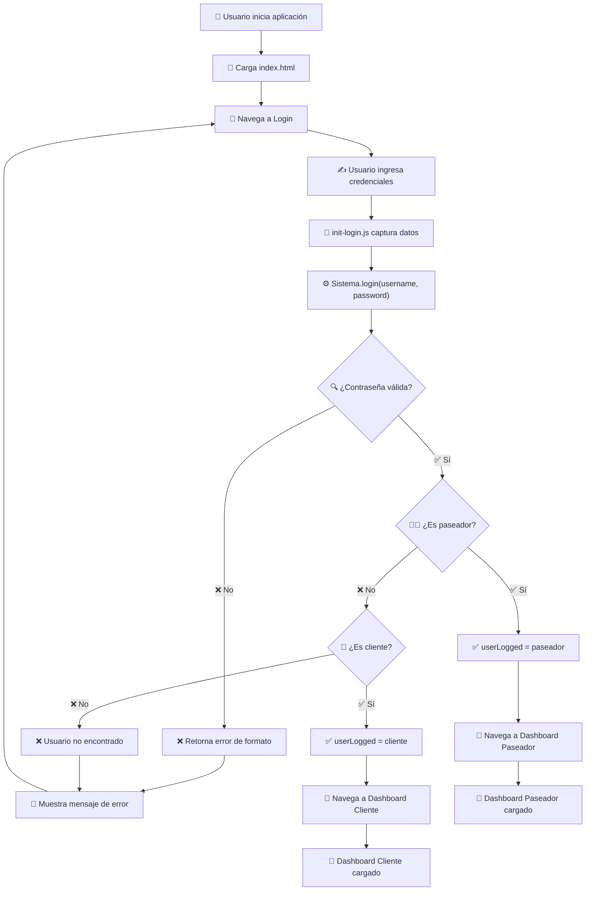
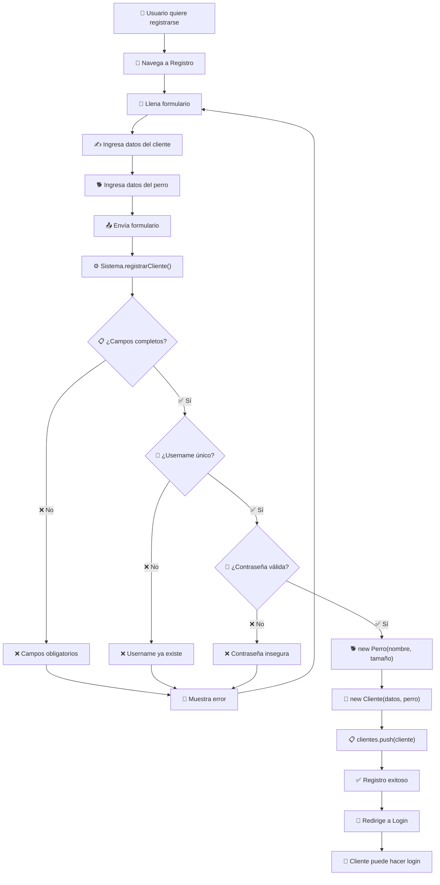
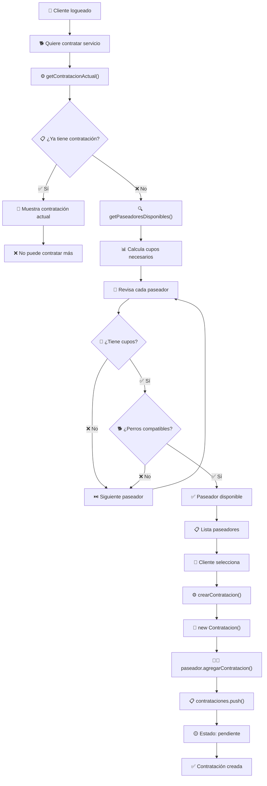
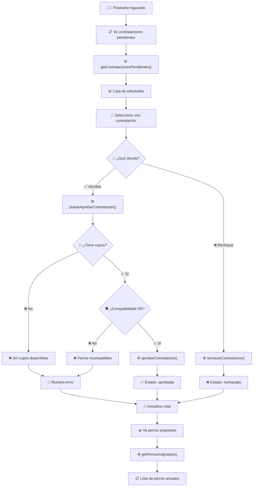
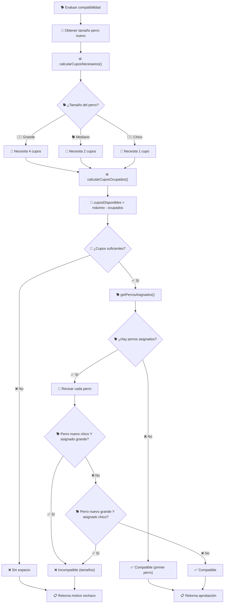

# 🔄 Flujos del Sistema Nubbi

Esta documentación describe los flujos principales del sistema con diagramas detallados.

## 📋 Índice de Flujos

1. [🔐 Flujo de Autenticación](#-flujo-de-autenticación)
2. [👥 Flujo de Registro de Cliente](#-flujo-de-registro-de-cliente)
3. [🐕 Flujo de Contratación de Servicio](#-flujo-de-contratación-de-servicio)
4. [👨‍💼 Flujo de Gestión de Paseador](#-flujo-de-gestión-de-paseador)
5. [⚙️ Flujo de Validación de Compatibilidad](#-flujo-de-validación-de-compatibilidad)

---

## 🔐 Flujo de Autenticación

**Objetivo**: Permitir que usuarios (clientes y paseadores) accedan al sistema de forma segura.

### 📊 Proceso



### 🔑 Validaciones Aplicadas

1. **Formato de Contraseña**:
   - Mínimo 5 caracteres
   - Al menos 1 mayúscula
   - Al menos 1 minúscula
   - Al menos 1 número

2. **Búsqueda de Usuario**:
   - Primero busca en paseadores
   - Luego busca en clientes
   - Compara username y password

3. **Establecimiento de Sesión**:
   - `userLogged` se establece con el objeto usuario
   - Redirección según el rol (cliente/paseador)

### ❌ Casos de Error

- **Contraseña inválida**: Formato incorrecto
- **Usuario no encontrado**: Username/password incorrectos
- **Campos vacíos**: Validación en frontend

---

## 👥 Flujo de Registro de Cliente

**Objetivo**: Permitir que nuevos usuarios se registren como clientes con información de su perro.

### 📊 Proceso



### 📋 Datos Requeridos

**Cliente**:
- Nombre completo
- Username único
- Contraseña segura

**Perro**:
- Nombre del perro
- Tamaño (chico/mediano/grande)

### ✅ Validaciones Secuenciales

1. **Campos Obligatorios**: Todos los campos deben estar llenos
2. **Username Único**: No debe existir en clientes ni paseadores
3. **Contraseña Segura**: Debe cumplir políticas de seguridad
4. **Creación de Objetos**: Perro → Cliente → Almacenamiento

### 🎯 Resultado Exitoso

- Cliente registrado en `clientes[]`
- Redirección a login
- Usuario puede iniciar sesión inmediatamente

---

## 🐕 Flujo de Contratación de Servicio

**Objetivo**: Permitir que clientes contraten servicios de paseo con paseadores disponibles.

### 📊 Proceso



### 🔒 Restricciones

1. **Una contratación por cliente**: No puede tener múltiples servicios activos
2. **Estados activos**: "pendiente" o "aprobada" bloquean nuevas contrataciones

### 🧮 Algoritmo de Compatibilidad

1. **Cálculo de Cupos**:
   - Perro grande: 4 cupos
   - Perro mediano: 2 cupos
   - Perro chico: 1 cupo

2. **Verificación de Disponibilidad**:
   - `cuposDisponibles = cupoMaximo - cuposOcupados`
   - Debe ser mayor o igual a cupos necesarios

3. **Compatibilidad de Tamaños**:
   - ❌ Grandes no con chicos
   - ✅ Medianos con cualquiera
   - ✅ Mismo tamaño siempre compatible

### 📋 Estados de Contratación

- **🟡 Pendiente**: Esperando respuesta del paseador
- **✅ Aprobada**: Servicio confirmado
- **❌ Rechazada**: Paseador rechazó
- **🚫 Cancelada**: Cliente canceló

---

## 👨‍💼 Flujo de Gestión de Paseador

**Objetivo**: Permitir que paseadores gestionen sus contrataciones y perros asignados.

### 📊 Proceso



### 🎯 Funcionalidades del Paseador

1. **Ver Contrataciones Pendientes**:
   - Lista filtrada por paseador
   - Solo estado "pendiente"

2. **Evaluar Solicitudes**:
   - Aprobar o rechazar
   - Validaciones automáticas de capacidad

3. **Gestionar Perros Asignados**:
   - Ver contrataciones aprobadas
   - Información de clientes y perros

### ⚡ Validaciones en Tiempo Real

- **Capacidad**: Verificación automática de cupos
- **Compatibilidad**: Evaluación de perros existentes
- **Feedback**: Mensajes específicos de por qué no puede aprobar

---

## ⚙️ Flujo de Validación de Compatibilidad

**Objetivo**: Asegurar que los perros asignados a un paseador sean compatibles entre sí.

### 📊 Proceso



### 🧮 Lógica de Cupos por Tamaño

```javascript
const cuposPorTamano = {
    "grande": 4,
    "mediano": 2,
    "chico": 1
};
```

### 🐕 Reglas de Compatibilidad

1. **Perros Grandes (4 cupos)**:
   - ✅ Pueden estar con otros grandes
   - ✅ Pueden estar con medianos
   - ❌ NO pueden estar con chicos

2. **Perros Medianos (2 cupos)**:
   - ✅ Pueden estar con cualquier tamaño
   - Son el "comodín" del sistema

3. **Perros Chicos (1 cupo)**:
   - ✅ Pueden estar con otros chicos
   - ✅ Pueden estar con medianos
   - ❌ NO pueden estar con grandes

### 🔍 Algoritmo de Validación

```javascript
function validarCompatibilidad(nuevoPerro, perrosAsignados) {
    // 1. Verificar cupos disponibles
    // 2. Si no hay perros asignados → Compatible
    // 3. Revisar cada perro asignado
    // 4. Aplicar reglas de incompatibilidad
    // 5. Retornar resultado con motivo
}
```

### 📊 Ejemplos de Compatibilidad

| Perros Actuales | Nuevo Perro | ¿Compatible? | Motivo |
|-----------------|-------------|--------------|--------|
| 2 Chicos | Grande | ❌ | Grandes no con chicos |
| 1 Grande | Chico | ❌ | Chicos no con grandes |
| 1 Mediano | Grande | ✅ | Medianos compatibles |
| 2 Grandes | Mediano | ✅ | Depende de cupos |
| Ninguno | Cualquiera | ✅ | Primer perro |

---
